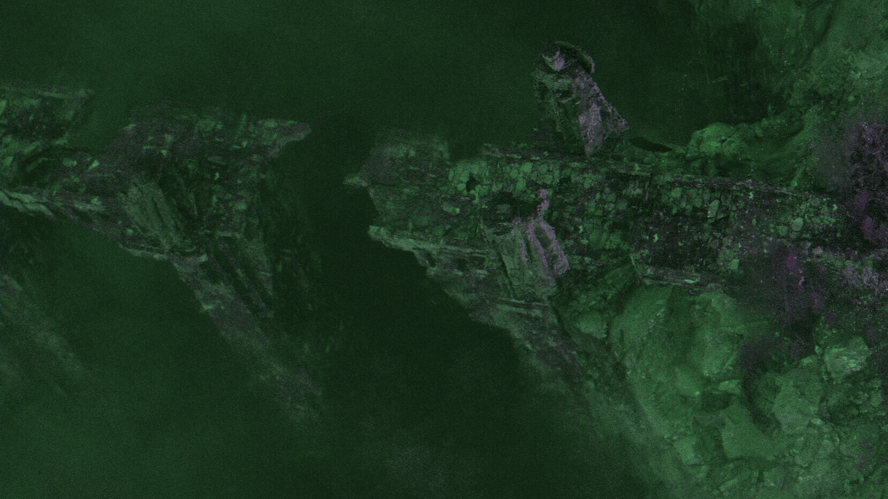

# Homework P2

## CUDA

### Using CUDA to make an image filter

- cudamalloc + cudamemcpy: allocationg and copying the array to the graphics card's memory to me processed
	- setting the block size to 1000
	- setting the block count based on the total number of pixels the image has
- running the filter function using the gpu

## Results





## Docs

Files:

- img\_to\_px.py: converts an image to its corresponding pixel values file
- filter.cu: takes a file with pixel values, applies the filter and returns the modified pixel values
- px\_to\_img.py: converts a pixel values file to an image


Filter:

- main: the main function
- applyFilter: reads the pixel values file, initializes all the needed resources, starts the filter process and writes the new values to a file
- flatten: converts a 3d array to a 1d array
- unflatten: converts a 1d array to a 3d array
- applyFilterOnGPU: applying the filtering function itself. Adding the needed values to each channel of the RGB so that the filter should be sepia:

```
blueValue  = (inputRed * .272) + (inputGreen *.534) + (inputBlue * .131);
greenValue = (inputRed * .349) + (inputGreen *.686) + (inputBlue * .168);
redValue   = (inputRed * .393) + (inputGreen *.769) + (inputBlue * .189);
```

