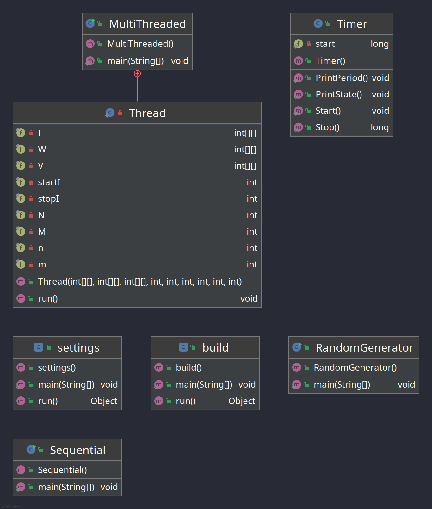
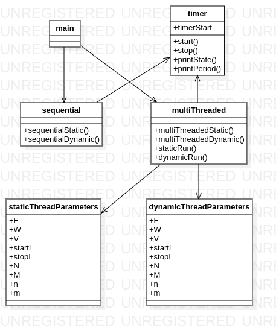

# Lab 1 homework

## Performance comparison

### Java

| Matrix type | Threads count | Execution time (ms) |
| --- | --- | --- |
| N=M=10 & n=m=3 | sequential | 0.0 |
| N=M=10 & n=m=3 | 4 | 0.6 |
| --- | --- | --- |
| N=M=1000 & n=m=5 | sequential | 117.7 |
| N=M=1000 & n=m=5 | 2 | 0.7 |
| N=M=1000 & n=m=5 | 4 | 0.4 |
| N=M=1000 & n=m=5 | 8 | 0.8 |
| N=M=1000 & n=m=5 | 16 | 1.3 |
| --- | --- | --- |
| N=10, M=10000 & n=m=5 | sequential | 16.3 |
| N=10, M=10000 & n=m=5 | 2 | 0.5 |
| N=10, M=10000 & n=m=5 | 4 | 0.7 |
| N=10, M=10000 & n=m=5 | 8 | 1.0 |
| N=10, M=10000 & n=m=5 | 16 | 1.4 |
| --- | --- | --- |
| N=10000, M=10 & n=m=5 | sequential | 24.1 |
| N=10000, M=10 & n=m=5 | 2 | 0.4 |
| N=10000, M=10 & n=m=5 | 4 | 0.6 |
| N=10000, M=10 & n=m=5 | 8 | 0.7 |
| N=10000, M=10 & n=m=5 | 16 | 1.2 |

**What we can notice:**
- almost all the time when it comes processing a big data volume, the paralleled workflow has a better performance time-wise
- more threads doesn't mean better performance. There is a treshold where more threads means more overhead and that begins to impact performance
- Java is optimised so that the iteration of the first dimension of an array is a bit faster than the iteration of the second dimension

### C++

| Matrix type | Allocation type | Threads count | Execution time (ms) |
| --- | --- | --- | --- |
| N=M=10 & n=m=3 | static | sequential | 0 |
| N=M=10 & n=m=3 | static | 4 | 8.7 |
| N=M=10 & n=m=3 | dynamic | sequential | 0 |
| N=M=10 & n=m=3 | dynamic | 4 | 0 |
| --- | --- | --- | --- |
| N=M=1000 & n=m=5 | static | sequential | 143.9 |
| N=M=1000 & n=m=5 | static | 2 | 164.4 |
| N=M=1000 & n=m=5 | static | 4 | 150.5 |
| N=M=1000 & n=m=5 | static | 8 | 223.2 |
| N=M=1000 & n=m=5 | static | 16 | 274 |
| N=M=1000 & n=m=5 | dynamic | sequential | 155.9 |
| N=M=1000 & n=m=5 | dynamic | 2 | 166.6 |
| N=M=1000 & n=m=5 | dynamic | 4 | 165.5 |
| N=M=1000 & n=m=5 | dynamic | 8 | 236.6 |
| N=M=1000 & n=m=5 | dynamic | 16 | 305.9 |
| --- | --- | --- | --- |
| N=10, M=10000 & n=m=5 | static | sequential | 14 |
| N=10, M=10000 & n=m=5 | static | 2 | 21.5 |
| N=10, M=10000 & n=m=5 | static | 4 | 28.5 |
| N=10, M=10000 & n=m=5 | static | 8 | 29.6 |
| N=10, M=10000 & n=m=5 | static | 16 | 30.9 |
| N=10, M=10000 & n=m=5 | dynamic | sequential | 15 |
| N=10, M=10000 & n=m=5 | dynamic | 2 | 16.8 |
| N=10, M=10000 & n=m=5 | dynamic | 4 | 18.1 |
| N=10, M=10000 & n=m=5 | dynamic | 8 | 22.2 |
| N=10, M=10000 & n=m=5 | dynamic | 16 | 32.8 |
| --- | --- | --- | --- |
| N=10000, M=10 & n=m=5 | static | sequential | 14.3 |
| N=10000, M=10 & n=m=5 | static | 2 | 16.1 |
| N=10000, M=10 & n=m=5 | static | 4 | 17.5 |
| N=10000, M=10 & n=m=5 | static | 8 | 28.8 |
| N=10000, M=10 & n=m=5 | static | 16 | 29.5 |
| N=10000, M=10 & n=m=5 | dynamic | sequential | 15 |
| N=10000, M=10 & n=m=5 | dynamic | 2 | 19.3 |
| N=10000, M=10 & n=m=5 | dynamic | 4 | 30.7 |
| N=10000, M=10 & n=m=5 | dynamic | 8 | 40.8 |
| N=10000, M=10 & n=m=5 | dynamic | 16 | 33.1 |

**What we can notice:**
- almost all the time when it comes processing a big data volume, the paralleled workflow has a worse performance time-wise
- static allocation is generally better than dynamic allocation, when a small amount of data is processed
- more threads doesn't mean better performance. There is a treshold where more threads means more overhead and that begins to impact performance
- C++ is optimised so that the iteration of the first dimension of an array is a bit faster than the iteration of the second dimension

## Diagrams

### Java

Classes:

- Sequential: runs the filter sequentially, without multi-threading
- MultiThreaded: splits the filtering process to a number of threads
	- Thread: a thread implementation that applies the filter to a number of pixels
- RandomGenerator: generates the image and filter data
- Timer: a stopwatch that measures the time related performace of the program

### C++

Functions:

- main: runs the application in the wanted mode
- sequential: runs the filter sequentially, with or without dynamic memori allocation
- multiThreaded: splits the filtering processes to a number of threads, with or without dynamic memory allocation

Classes:

- timer: a stopwatch that measures the time related performance of the program

## Conclusion

Java is worse than C++ when it comes to sequential workloads, but is much more efficient at parallelization jobs.

