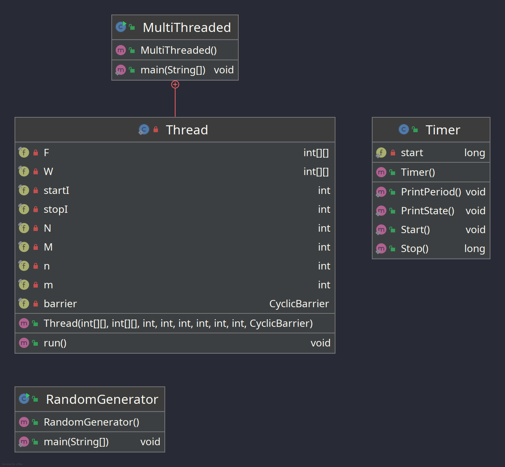
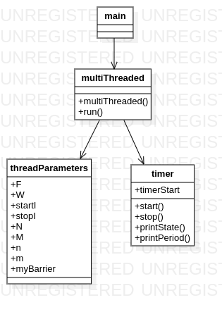

# Homework 2

## Performance comparison

### Java

| Matrix type | Threads count | Execution time (ms) |
| --- | --- | --- |
| N=M=10 & n=m=3 | 2 | 1 |
| --- | --- | --- |
| N=M=1000 & n=m=5 | 1 | 69 |
| N=M=1000 & n=m=5 | 2 | 48 |
| N=M=1000 & n=m=5 | 4 | 51 |
| N=M=1000 & n=m=5 | 8 | 59 |
| N=M=1000 & n=m=5 | 16| 77 |
| --- | --- | --- |
| N=10, M=10000 & n=m=5 | 1 | 16 |
| N=10, M=10000 & n=m=5 | 2 | 33 |
| N=10, M=10000 & n=m=5 | 4 | 35 |
| N=10, M=10000 & n=m=5 | 8 | 38 |
| N=10, M=10000 & n=m=5 | 16| 61 |
| --- | --- | --- |
| N=10000, M=10 & n=m=5 | 1 | 16 |
| N=10000, M=10 & n=m=5 | 2 | 49 |
| N=10000, M=10 & n=m=5 | 4 | 42 |
| N=10000, M=10 & n=m=5 | 8 | 33 |
| N=10000, M=10 & n=m=5 | 16| 58 |

**What we can notice:**
- almost all the time when it comes processing a big data volume, the paralleled workflow has a better performance time-wise
- more threads doesn't mean better performance. There is a treshold where more threads means more overhead and that begins to impact performance
- the old implementation is faster and consumes less memory (for my implementation)

### C++

| Matrix type | Threads count | Execution time (ms) |
| --- | --- | --- |
| N=M=10 & n=m=3 | 2 | 0 |
| --- | --- | --- |
| N=M=1000 & n=m=5 | 1 | 73 |
| N=M=1000 & n=m=5 | 2 | 74 |
| N=M=1000 & n=m=5 | 4 | 90 |
| N=M=1000 & n=m=5 | 8 | 145 |
| N=M=1000 & n=m=5 | 16 | 138 |
| --- | --- | --- |
| N=10, M=10000 & n=m=5 | 1 | 9 |
| N=10, M=10000 & n=m=5 | 2 | 8 |
| N=10, M=10000 & n=m=5 | 4 | 9 |
| N=10, M=10000 & n=m=5 | 8 | 14 |
| N=10, M=10000 & n=m=5 | 16 | 21 |
| --- | --- | --- |
| N=10000, M=10 & n=m=5 | 1 | 14 |
| N=10000, M=10 & n=m=5 | 2 | 12 |
| N=10000, M=10 & n=m=5 | 4 | 11 |
| N=10000, M=10 & n=m=5 | 8 | 13 |
| N=10000, M=10 & n=m=5 | 16 | 15 |

**What we can notice:**
- almost all the time when it comes processing a big data volume, the paralleled workflow has a worse performance time-wise
- more threads doesn't mean better performance. There is a treshold where more threads means more overhead and that begins to impact performance
- the old implementation is slower but consumes less memory (for my implementation)

## Diagrams

### Java

Classes:

- MultiThreaded: splits the filtering process to a number of threads
	- Thread: a thread implementation that applies the filter to a number of pixels
- RandomGenerator: generates the image and filter data
- Timer: a stopwatch that measures the time related performace of the program

### C++

Functions:

- main: runs the application in the wanted mode
- multiThreaded: splits the filtering processes to a number of threads, with or without dynamic memory allocation

Classes:

- timer: a stopwatch that measures the time related performance of the program

## Conclusion

Java is worse than C++ when it comes to sequential workloads, but is much more efficient at parallelization jobs.

