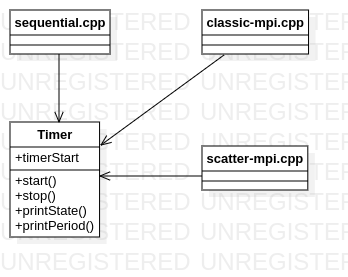

# Homework 3

## Performance comparison

### C++

Cores Count = 6

| Input numbers | Implementation | Execution time (ms) |
| --- | --- | --- |
| Number1=Number2=123456789123456789 | sequential | 0 |
| Number1=Number2=123456789123456789 | classic mpi | 0 |
| Number1=Number2=123456789123456789 | scatter mpi | 0 |
| --- | --- | --- |
| N1=N2=1000 | sequential | 0 |
| N1=N2=1000 | classic mpi | 0 |
| N1=N2=1000 | scatter mpi | 0 |
| --- | --- | --- |
| N1=100 N2=100000 | sequential | 0 |
| N1=100 N2=100000 | classic mpi | 0 |
| N1=100 N2=100000 | scatter mpi | 1 |

**What we can notice:**
- on 6 cores (6 processes) the numbers are too small and the adding operation is so fast that no difference can be seen between the implementation performances
- scatter might be a bit slower than classic send-recv implementations

## Diagrams

### C++

Files:

- sequential: runs the sequential implementation
- classic-mpi: runs the classic send-recv implementation
- scatter-mpi: runs the scatter-gather implementation

Classes:

- timer: a stopwatch that measures the time related performance of the program

