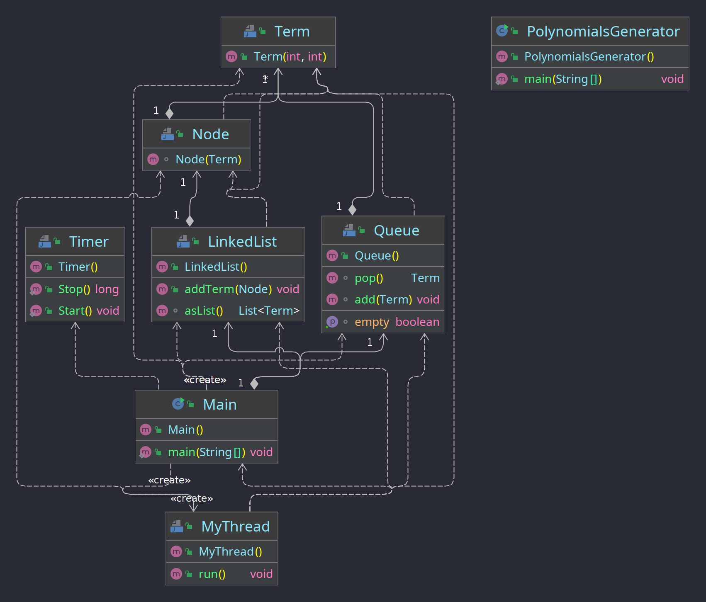

# Homework 4

## Performance comparison

### Java

| Input | Threads count | Execution time (ms) |
| --- | --- | --- |
| polynomials=10, max exponent=1000, terms=100 | 1 | 78 |
| polynomials=10, max exponent=1000, terms=100 | 4 | 82 |
| polynomials=10, max exponent=1000, terms=100 | 6 | 81 |
| polynomials=10, max exponent=1000, terms=100 | 8 | 82 |
| --- | --- | --- |
| polynomials=5, max exponent=10000, terms=500 | 1 | 91 |
| polynomials=5, max exponent=10000, terms=500 | 4 | 95 |
| polynomials=5, max exponent=10000, terms=500 | 6 | 98 |
| polynomials=5, max exponent=10000, terms=500 | 8 | 96 |

**What we can notice:**
- adding more threads does not mean better performance
- the performance is not so much impared by the number of terms the program has to process

## Syncronization

### Weak points

- when adding to the linked list
- when popping from the queue

### Solutions

- using `syncronized` in `MyThread` for any operation that needs to modify the state of the linked list or the queue

## Diagrams

Classes:

- Timer: a stopwatch that measures the time related performance of the program
- Main: the main part of the program
- LinkedList: a simple linked list implementation using the Node class, ordered by the terms' exponents
- Node: a node part of the linked list implementation
- Term: a polynomial term representation of data
- Queue: a queue of polynomial terms
- MyThread: a thread that handles getting a term from the queue and adding it to the polynomial
- PolynomialsGenerator: generates random polynomials based on input features

